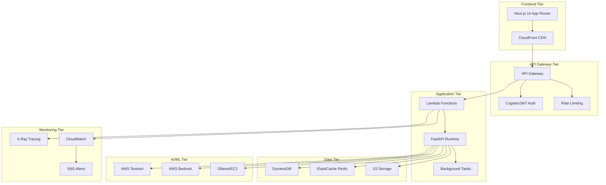

# Design Document

## Overview

This design document outlines the modernization of the Stock Analysis Tool's tech stack to improve performance, scalability, maintainability, and developer experience. The current system has a solid foundation but needs architectural improvements to handle production workloads efficiently and provide a better development experience.

## Architecture

### Current State Analysis

**Strengths:**
- FastAPI backend with async support
- Next.js 14 frontend with modern React patterns
- AWS integration for cloud services
- Background task processing implementation
- Comprehensive financial analysis capabilities

**Areas for Improvement:**
- Mixed database strategy (SQLite + DynamoDB) creates complexity
- Manual infrastructure management
- Limited observability and monitoring
- Inconsistent error handling patterns
- Missing production-ready security measures
- Development environment setup complexity

### Target Architecture



## Components and Interfaces

### 1. Backend API Modernization

**FastAPI Application Structure:**
```python
# Modern FastAPI structure with dependency injection
from fastapi import FastAPI, Depends
from contextlib import asynccontextmanager

@asynccontextmanager
async def lifespan(app: FastAPI):
    # Startup
    await initialize_services()
    yield
    # Shutdown
    await cleanup_services()

app = FastAPI(
    title="Stock Analysis API",
    version="2.0.0",
    lifespan=lifespan
)

# Dependency injection container
class ServiceContainer:
    def __init__(self):
        self.database = DatabaseService()
        self.cache = CacheService()
        self.ai_service = AIService()
```

**Data Source Priority Strategy:**
```python
class DataSourceManager:
    def __init__(self):
        # Primary data source
        self.yahoo_finance = YahooFinanceClient()
        
        # Backup sources in priority order
        self.market_stack = MarketStackClient()  # Primary backup
        self.alpha_vantage = AlphaVantageClient()
        self.fmp = FinancialModelingPrepClient()
        self.google_finance = GoogleFinanceClient()
    
    async def get_stock_price(self, ticker: str) -> Optional[float]:
        # Try Yahoo Finance first (5 different methods)
        price = await self.yahoo_finance.get_price_with_fallbacks(ticker)
        if price:
            return price
        
        # Try Market Stack as primary backup
        price = await self.market_stack.get_current_price(ticker)
        if price:
            return price
        
        # Continue with other backup sources...
        return await self._try_remaining_sources(ticker)
```

### 2. Database Layer Unification

**Repository Pattern Implementation:**
```python
from abc import ABC, abstractmethod

class DatabaseRepository(ABC):
    @abstractmethod
    async def save_analysis(self, analysis: StockAnalysis) -> str: ...
    
class DynamoDBRepository(DatabaseRepository):
    # Production implementation
    
class SQLiteRepository(DatabaseRepository):
    # Development implementation

# Factory pattern for database selection
def create_repository() -> DatabaseRepository:
    if settings.ENVIRONMENT == "production":
        return DynamoDBRepository()
    return SQLiteRepository()
```

**DynamoDB Schema Design:**
```
Table: stock-analyses
PK: TICKER#{ticker}
SK: DATE#{date}

GSI1: Exchange-Date Index
GSI1PK: EXCHANGE#{exchange}
GSI1SK: DATE#{date}

GSI2: Recommendation-Date Index  
GSI2PK: REC#{recommendation}
GSI2SK: DATE#{date}

GSI3: Sector-Quality Index
GSI3PK: SECTOR#{sector}
GSI3SK: QUALITY#{score}
```

### 3. Frontend Enhancement

**Next.js App Router Structure:**
```typescript
// app/layout.tsx - Root layout with providers
export default function RootLayout({ children }: { children: React.ReactNode }) {
  return (
    <html lang="en">
      <body>
        <Providers>
          <Navigation />
          <main>{children}</main>
          <Footer />
        </Providers>
      </body>
    </html>
  )
}

// State management with Zustand
interface AppState {
  analyses: StockAnalysis[]
  loading: boolean
  error: string | null
  
  // Actions
  fetchAnalysis: (ticker: string) => Promise<void>
  clearError: () => void
}

const useAppStore = create<AppState>((set, get) => ({
  analyses: [],
  loading: false,
  error: null,
  
  fetchAnalysis: async (ticker: string) => {
    set({ loading: true, error: null })
    try {
      const analysis = await api.getAnalysis(ticker)
      set(state => ({ 
        analyses: [...state.analyses, analysis],
        loading: false 
      }))
    } catch (error) {
      set({ error: error.message, loading: false })
    }
  },
  
  clearError: () => set({ error: null })
}))
```

**Component Architecture:**
```typescript
// Server Components for data fetching
async function AnalysisPage({ params }: { params: { ticker: string } }) {
  const analysis = await getAnalysis(params.ticker)
  
  return (
    <div>
      <AnalysisHeader analysis={analysis} />
      <AnalysisCharts analysis={analysis} />
      <AnalysisDetails analysis={analysis} />
    </div>
  )
}

// Client Components for interactivity
'use client'
function InteractiveChart({ data }: { data: ChartData }) {
  const [selectedPeriod, setSelectedPeriod] = useState('1Y')
  
  return (
    <div>
      <PeriodSelector value={selectedPeriod} onChange={setSelectedPeriod} />
      <Chart data={data} period={selectedPeriod} />
    </div>
  )
}
```

### 4. Infrastructure as Code

**AWS CDK Stack:**
```typescript
export class StockAnalysisStack extends Stack {
  constructor(scope: Construct, id: string, props?: StackProps) {
    super(scope, id, props)
    
    // DynamoDB Table
    const table = new Table(this, 'StockAnalysesTable', {
      partitionKey: { name: 'PK', type: AttributeType.STRING },
      sortKey: { name: 'SK', type: AttributeType.STRING },
      billingMode: BillingMode.PAY_PER_REQUEST,
      pointInTimeRecovery: true,
      encryption: TableEncryption.AWS_MANAGED
    })
    
    // Lambda Function
    const apiFunction = new Function(this, 'ApiFunction', {
      runtime: Runtime.PYTHON_3_11,
      handler: 'main.handler',
      code: Code.fromAsset('dist'),
      environment: {
        TABLE_NAME: table.tableName,
        REDIS_ENDPOINT: cache.attrRedisEndpoint
      },
      tracing: Tracing.ACTIVE
    })
    
    // API Gateway
    const api = new RestApi(this, 'StockAnalysisApi', {
      restApiName: 'Stock Analysis API',
      description: 'Serverless stock analysis API'
    })
    
    // CloudFront Distribution
    const distribution = new Distribution(this, 'WebDistribution', {
      defaultBehavior: {
        origin: new S3Origin(websiteBucket),
        viewerProtocolPolicy: ViewerProtocolPolicy.REDIRECT_TO_HTTPS
      }
    })
  }
}
```

### 5. Caching Strategy

**Multi-Layer Caching:**
```python
class CacheService:
    def __init__(self):
        self.redis = Redis.from_url(settings.REDIS_URL)
        self.local_cache = TTLCache(maxsize=1000, ttl=300)  # 5 min local cache
    
    async def get(self, key: str) -> Optional[Any]:
        # L1: Local cache (fastest)
        if key in self.local_cache:
            return self.local_cache[key]
        
        # L2: Redis cache (fast)
        value = await self.redis.get(key)
        if value:
            parsed = json.loads(value)
            self.local_cache[key] = parsed
            return parsed
        
        return None
    
    async def set(self, key: str, value: Any, ttl: int = 3600):
        # Set in both caches
        self.local_cache[key] = value
        await self.redis.setex(key, ttl, json.dumps(value, default=str))
```

**Cache Invalidation Strategy:**
```python
class CacheInvalidationService:
    def __init__(self, cache: CacheService, event_bus: EventBus):
        self.cache = cache
        self.event_bus = event_bus
    
    async def invalidate_stock_analysis(self, ticker: str):
        patterns = [
            f"analysis:{ticker}:*",
            f"quote:{ticker}",
            f"watchlist:*:{ticker}",
            "market:summary"  # Invalidate market summary if major stock changes
        ]
        
        for pattern in patterns:
            await self.cache.delete_pattern(pattern)
        
        # Publish event for other services
        await self.event_bus.publish("stock.analysis.updated", {"ticker": ticker})
```

## Data Models

### Core Domain Models

```python
from pydantic import BaseModel, Field
from datetime import datetime
from typing import Optional, Dict, List
from enum import Enum

class BusinessType(str, Enum):
    TECHNOLOGY = "technology"
    FINANCIAL = "financial"
    HEALTHCARE = "healthcare"
    CONSUMER = "consumer"
    INDUSTRIAL = "industrial"
    REIT = "reit"
    BANK = "bank"
    INSURANCE = "insurance"

class AnalysisWeights(BaseModel):
    dcf_weight: float = Field(ge=0, le=1)
    epv_weight: float = Field(ge=0, le=1)
    asset_weight: float = Field(ge=0, le=1)
    
    def normalize(self):
        total = self.dcf_weight + self.epv_weight + self.asset_weight
        if total > 0:
            self.dcf_weight /= total
            self.epv_weight /= total
            self.asset_weight /= total

class ValuationBreakdown(BaseModel):
    dcf_value: Optional[float] = None
    epv_value: Optional[float] = None
    asset_based_value: Optional[float] = None
    weighted_average: float
    confidence_score: float = Field(ge=0, le=1)

class StockAnalysis(BaseModel):
    ticker: str
    company_name: str
    current_price: float
    fair_value: float
    margin_of_safety: float
    recommendation: str
    
    # Valuation details
    valuation: ValuationBreakdown
    business_type: BusinessType
    analysis_weights: AnalysisWeights
    
    # Scores
    financial_health_score: float = Field(ge=0, le=10)
    business_quality_score: float = Field(ge=0, le=10)
    management_quality_score: float = Field(ge=0, le=10)
    
    # Metadata
    analyzed_at: datetime
    analysis_date: str
    currency: str = "USD"
    
    class Config:
        json_encoders = {
            datetime: lambda v: v.isoformat()
        }
```

### Database Models

```python
# DynamoDB item structure
class DynamoDBStockAnalysis(BaseModel):
    PK: str  # TICKER#{ticker}
    SK: str  # DATE#{date}
    
    # GSI keys
    GSI1PK: Optional[str] = None  # EXCHANGE#{exchange}
    GSI1SK: Optional[str] = None  # DATE#{date}
    GSI2PK: Optional[str] = None  # REC#{recommendation}
    GSI2SK: Optional[str] = None  # DATE#{date}
    GSI3PK: Optional[str] = None  # SECTOR#{sector}
    GSI3SK: Optional[str] = None  # QUALITY#{score}
    
    # Analysis data
    analysis_data: Dict  # Full StockAnalysis as nested object
    
    # Quick access fields for filtering
    current_price: Optional[float] = None
    fair_value: Optional[float] = None
    margin_of_safety_pct: Optional[float] = None
    recommendation: Optional[str] = None
    
    # Timestamps
    analyzed_at: str
    ttl: Optional[int] = None  # For automatic cleanup
```

## Correctness Properties

*A property is a characteristic or behavior that should hold true across all valid executions of a system-essentially, a formal statement about what the system should do. Properties serve as the bridge between human-readable specifications and machine-verifiable correctness guarantees.*

### Property Reflection

After analyzing all acceptance criteria, I identified several properties that can be consolidated to avoid redundancy:

- **Caching properties** (5.2, 5.6) can be combined into comprehensive cache behavior validation
- **Security properties** (7.1, 7.2, 7.3, 7.4, 7.5, 7.6) can be grouped by security domain
- **Monitoring properties** (9.1, 9.2, 9.3, 9.4, 9.5, 9.6) share common observability patterns
- **Data processing properties** (10.1, 10.3, 10.4, 10.5, 10.6) can be unified around data pipeline correctness

### Core Properties

**Property 1: Data Validation Consistency**
*For any* data input to the system, validation should consistently reject invalid data and accept valid data according to the defined schema
**Validates: Requirements 1.3, 10.3**

**Property 2: Structured Logging Compliance**
*For any* system operation that generates logs, the log entry should contain a correlation ID and follow JSON format with required fields
**Validates: Requirements 1.4, 9.2**

**Property 3: Error Handling Uniformity**
*For any* error condition in the system, the error should be caught, transformed into a consistent format, and returned with appropriate HTTP status codes
**Validates: Requirements 1.5, 3.6**

**Property 4: Database Migration Idempotency**
*For any* database migration operation, running the migration multiple times should produce the same final state without errors
**Validates: Requirements 2.5**

**Property 5: Connection Resilience**
*For any* external service connection (database, API, cache), failed operations should be retried according to policy and connections should be reused when possible
**Validates: Requirements 2.6, 5.4, 10.1**

**Property 6: State Management Consistency**
*For any* state update in the frontend application, the state should be properly synchronized across all components that depend on it
**Validates: Requirements 3.4**

**Property 7: Rate Limiting Enforcement**
*For any* API endpoint, requests exceeding the configured rate limit should be rejected with appropriate status codes while allowing valid requests through
**Validates: Requirements 4.3, 7.3**

**Property 8: Monitoring Data Availability**
*For any* system operation, appropriate metrics should be emitted to CloudWatch and trace data should be available in X-Ray
**Validates: Requirements 4.4, 9.1, 9.3**

**Property 9: Secrets Management Security**
*For any* sensitive configuration value, it should be retrieved from AWS Secrets Manager rather than environment variables or hardcoded values
**Validates: Requirements 4.5**

**Property 10: Cache Invalidation Correctness**
*For any* cached data, when the underlying data changes, the cache entry should be invalidated and subsequent requests should return fresh data
**Validates: Requirements 5.2**

**Property 11: Response Compression Efficiency**
*For any* API response above a configured size threshold, the response should be compressed and properly handled by clients
**Validates: Requirements 5.3**

**Property 12: Performance SLA Compliance**
*For any* cached data request, the response time should be under 200ms
**Validates: Requirements 5.6**

**Property 13: PDF Processing Fallback Resilience**
*For any* PDF processing request, if Textract fails, the system should fall back to OCR and still produce extraction results
**Validates: Requirements 6.2**

**Property 14: Document Similarity Accuracy**
*For any* pair of similar financial documents, their vector embeddings should have high cosine similarity (>0.8)
**Validates: Requirements 6.4**

**Property 15: Streaming Response Continuity**
*For any* long-running AI operation, streaming updates should be provided to clients without interruption until completion
**Validates: Requirements 6.5**

**Property 16: AI Model Version Consistency**
*For any* A/B test configuration, requests should be consistently routed to the same model version for the same user session
**Validates: Requirements 6.6**

**Property 17: JWT Authentication Security**
*For any* authentication request, JWT tokens should expire according to policy and refresh tokens should successfully generate new access tokens
**Validates: Requirements 7.1**

**Property 18: HTTPS Communication Enforcement**
*For any* system communication, HTTPS should be used and HTTP requests should be rejected or redirected
**Validates: Requirements 7.2**

**Property 19: IAM Least Privilege Compliance**
*For any* AWS service access, the system should only have the minimum required permissions and should fail when attempting unauthorized operations
**Validates: Requirements 7.4**

**Property 20: Audit Logging Completeness**
*For any* data access operation, an audit log entry should be created with appropriate details (user, timestamp, operation, resource)
**Validates: Requirements 7.5**

**Property 21: Data Encryption Verification**
*For any* sensitive data, it should be encrypted when stored and transmitted, and decryption should only be possible with proper credentials
**Validates: Requirements 7.6**

**Property 22: Event-Driven Architecture Reliability**
*For any* event published to EventBridge, the event should be processed by all registered handlers without data loss
**Validates: Requirements 10.2**

**Property 23: Batch Processing Completeness**
*For any* batch job processing a dataset, all valid records should be processed successfully and invalid records should be logged with reasons
**Validates: Requirements 10.4**

**Property 24: Data Lineage Traceability**
*For any* data transformation, the lineage information should allow tracing from the final result back to the original source
**Validates: Requirements 10.5**

**Property 25: Real-time Streaming Accuracy**
*For any* real-time data stream, updates should be delivered to clients within the configured latency threshold without data loss
**Validates: Requirements 10.6**

**Property 26: Market Stack API Resilience**
*For any* stock price request, when primary data sources fail, Market Stack API should successfully provide backup data within acceptable response times
**Validates: Requirements 10.7, 10.8**

<function_calls>
<invoke name="prework">
<parameter name="featureName">tech-stack-modernization

## Error Handling

### Centralized Error Management

**Error Classification:**
```python
from enum import Enum
from typing import Optional, Dict, Any

class ErrorCategory(str, Enum):
    VALIDATION = "validation"
    AUTHENTICATION = "authentication"
    AUTHORIZATION = "authorization"
    NOT_FOUND = "not_found"
    EXTERNAL_API = "external_api"
    DATABASE = "database"
    CACHE = "cache"
    INTERNAL = "internal"

class AppException(Exception):
    def __init__(
        self,
        message: str,
        category: ErrorCategory,
        status_code: int = 500,
        details: Optional[Dict[str, Any]] = None,
        correlation_id: Optional[str] = None
    ):
        self.message = message
        self.category = category
        self.status_code = status_code
        self.details = details or {}
        self.correlation_id = correlation_id
        super().__init__(message)

# Specific exception classes
class ValidationError(AppException):
    def __init__(self, message: str, field: str, value: Any):
        super().__init__(
            message=message,
            category=ErrorCategory.VALIDATION,
            status_code=400,
            details={"field": field, "value": value}
        )

class ExternalAPIError(AppException):
    def __init__(self, message: str, service: str, status_code: int = 502):
        super().__init__(
            message=message,
            category=ErrorCategory.EXTERNAL_API,
            status_code=status_code,
            details={"service": service}
        )
```

**Global Error Handler:**
```python
from fastapi import Request, HTTPException
from fastapi.responses import JSONResponse
import logging

logger = logging.getLogger(__name__)

@app.exception_handler(AppException)
async def app_exception_handler(request: Request, exc: AppException):
    correlation_id = exc.correlation_id or request.headers.get("x-correlation-id")
    
    # Log error with context
    logger.error(
        "Application error occurred",
        extra={
            "correlation_id": correlation_id,
            "error_category": exc.category,
            "error_message": exc.message,
            "status_code": exc.status_code,
            "request_path": request.url.path,
            "request_method": request.method,
            "details": exc.details
        }
    )
    
    return JSONResponse(
        status_code=exc.status_code,
        content={
            "error": {
                "message": exc.message,
                "category": exc.category,
                "correlation_id": correlation_id,
                "details": exc.details
            }
        },
        headers={"x-correlation-id": correlation_id}
    )
```

### Circuit Breaker Pattern

```python
import asyncio
from datetime import datetime, timedelta
from typing import Callable, Any
from enum import Enum

class CircuitState(Enum):
    CLOSED = "closed"
    OPEN = "open"
    HALF_OPEN = "half_open"

class CircuitBreaker:
    def __init__(
        self,
        failure_threshold: int = 5,
        timeout: int = 60,
        expected_exception: type = Exception
    ):
        self.failure_threshold = failure_threshold
        self.timeout = timeout
        self.expected_exception = expected_exception
        
        self.failure_count = 0
        self.last_failure_time = None
        self.state = CircuitState.CLOSED
    
    async def call(self, func: Callable, *args, **kwargs) -> Any:
        if self.state == CircuitState.OPEN:
            if self._should_attempt_reset():
                self.state = CircuitState.HALF_OPEN
            else:
                raise ExternalAPIError(
                    "Circuit breaker is OPEN",
                    service=func.__name__
                )
        
        try:
            result = await func(*args, **kwargs)
            self._on_success()
            return result
        except self.expected_exception as e:
            self._on_failure()
            raise
    
    def _should_attempt_reset(self) -> bool:
        return (
            self.last_failure_time and
            datetime.now() - self.last_failure_time >= timedelta(seconds=self.timeout)
        )
    
    def _on_success(self):
        self.failure_count = 0
        self.state = CircuitState.CLOSED
    
    def _on_failure(self):
        self.failure_count += 1
        self.last_failure_time = datetime.now()
        
        if self.failure_count >= self.failure_threshold:
            self.state = CircuitState.OPEN
```

## Testing Strategy

### Dual Testing Approach

The system will implement both unit testing and property-based testing for comprehensive coverage:

**Unit Tests:**
- Specific examples and edge cases
- Integration points between components
- Error conditions and boundary cases
- Mock external dependencies for isolated testing

**Property-Based Tests:**
- Universal properties across all inputs
- Comprehensive input coverage through randomization
- Minimum 100 iterations per property test
- Each test tagged with corresponding design property

### Testing Framework Configuration

**Backend Testing (Python):**
```python
# pytest configuration
import pytest
from hypothesis import given, strategies as st
from fastapi.testclient import TestClient

# Property-based test example
@given(
    ticker=st.text(min_size=1, max_size=10, alphabet=st.characters(whitelist_categories=('Lu', 'Ll', 'Nd'))),
    price=st.floats(min_value=0.01, max_value=10000.0)
)
def test_stock_analysis_data_validation_property(ticker: str, price: float):
    """
    Feature: tech-stack-modernization, Property 1: Data Validation Consistency
    For any data input to the system, validation should consistently reject invalid data and accept valid data
    """
    analysis_data = {
        "ticker": ticker,
        "current_price": price,
        "company_name": "Test Company"
    }
    
    # Valid data should pass validation
    validated = StockAnalysis(**analysis_data)
    assert validated.ticker == ticker.upper()
    assert validated.current_price == price

# Unit test example
def test_health_check_endpoint():
    """Test that health check endpoint returns expected format"""
    with TestClient(app) as client:
        response = client.get("/health")
        assert response.status_code == 200
        assert "status" in response.json()
        assert response.json()["status"] == "healthy"
```

**Frontend Testing (TypeScript/Jest):**
```typescript
// Jest configuration with property-based testing
import { render, screen } from '@testing-library/react'
import { fc } from 'fast-check'
import { StockAnalysis } from '@/types/analysis'

// Property-based test
describe('State Management Consistency', () => {
  it('should maintain state consistency across components', () => {
    fc.assert(fc.property(
      fc.record({
        ticker: fc.string({ minLength: 1, maxLength: 10 }),
        price: fc.float({ min: 0.01, max: 10000 }),
        recommendation: fc.constantFrom('BUY', 'HOLD', 'SELL')
      }),
      (analysis) => {
        // Feature: tech-stack-modernization, Property 6: State Management Consistency
        const { result } = renderHook(() => useAppStore())
        
        act(() => {
          result.current.updateAnalysis(analysis)
        })
        
        expect(result.current.analyses).toContain(analysis)
        expect(result.current.loading).toBe(false)
      }
    ))
  })
})

// Unit test
test('renders analysis card with correct data', () => {
  const mockAnalysis: StockAnalysis = {
    ticker: 'AAPL',
    currentPrice: 150.00,
    fairValue: 180.00,
    recommendation: 'BUY'
  }
  
  render(<AnalysisCard analysis={mockAnalysis} />)
  
  expect(screen.getByText('AAPL')).toBeInTheDocument()
  expect(screen.getByText('$150.00')).toBeInTheDocument()
  expect(screen.getByText('BUY')).toBeInTheDocument()
})
```

### Performance Testing

**Load Testing Configuration:**
```python
# locust configuration for load testing
from locust import HttpUser, task, between

class StockAnalysisUser(HttpUser):
    wait_time = between(1, 3)
    
    @task(3)
    def get_analysis(self):
        ticker = self.client.get("/api/random-ticker").json()["ticker"]
        self.client.get(f"/api/analyze/{ticker}")
    
    @task(1)
    def get_cached_quote(self):
        self.client.get("/api/quote/AAPL/cached")
    
    def on_start(self):
        # Authenticate if needed
        pass
```

### Integration Testing

**End-to-End Testing:**
```typescript
// Playwright E2E tests
import { test, expect } from '@playwright/test'

test('complete stock analysis workflow', async ({ page }) => {
  await page.goto('/')
  
  // Search for stock
  await page.fill('[data-testid=stock-search]', 'AAPL')
  await page.click('[data-testid=search-button]')
  
  // Wait for analysis to complete
  await expect(page.locator('[data-testid=analysis-result]')).toBeVisible({ timeout: 30000 })
  
  // Verify analysis components are present
  await expect(page.locator('[data-testid=fair-value]')).toBeVisible()
  await expect(page.locator('[data-testid=margin-of-safety]')).toBeVisible()
  await expect(page.locator('[data-testid=recommendation]')).toBeVisible()
})
```

This comprehensive testing strategy ensures that both specific functionality and universal properties are validated, providing confidence in the system's correctness and reliability.